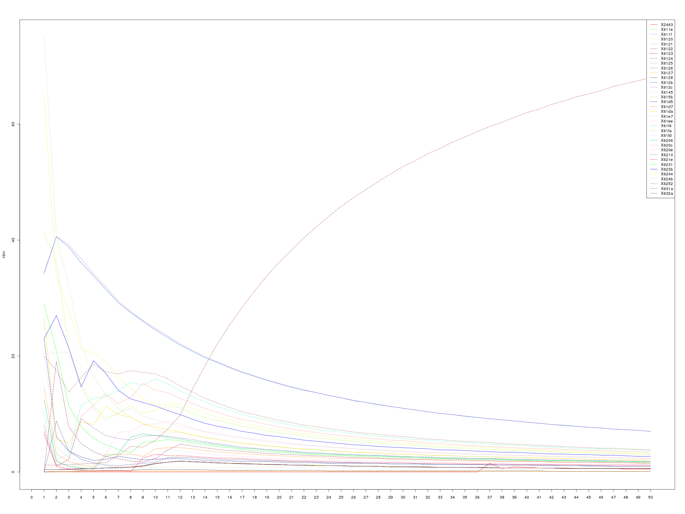
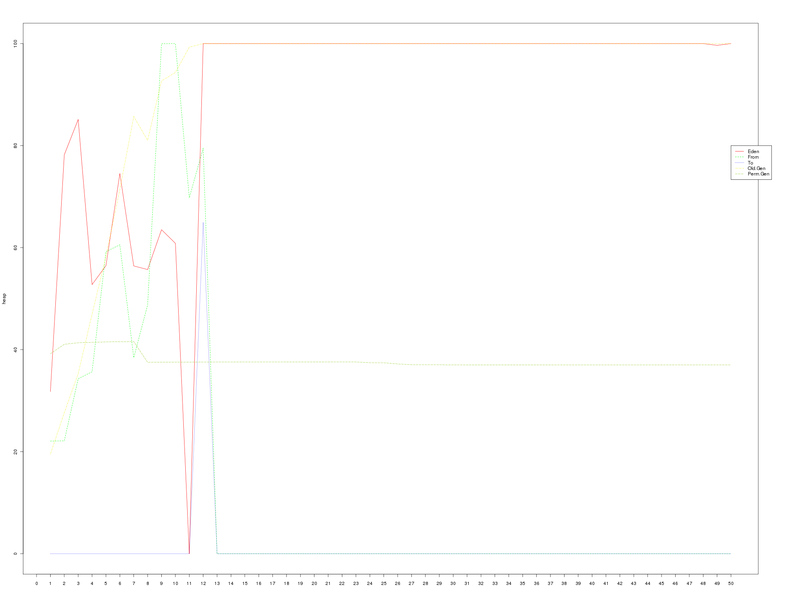

http://rhq-project.org[RHQ] is not built to be used by thousands of
users at the same time. We rather add features to the page so that it
contains maximum information and context so that the users can make the
right decisions about their infrastructure. But even then we do care
about a responsive and reasonably performing UI (and the system as a
whole of course).

Recently I've been tasked with researching theperformance of our UI layer.
Obviously there are a thousand factors influencing the responsiveness of the
UI but for the web app developer,there are only a few s/he can do something 
about. Those in a nutshell are CPU and memory usage of the web app itself 
and efficiency in the communication with whatever back-end the webapp is 
using to pull its data from (usually a DB, but in case of RHQ also the 
agents). We did quite a bit of testing on database and agent communication 
but we lacked the performance data for the UI layer of RHQ. There obviously 
are some candidate pages that one might suspect of a need for performance
enhancements but which ones to pick? The first thing to decide was to
actually determine how to measure the performance of the system. One of
the obvious metrics to use is the response time of the HTTP requests.
This would be a good start because it'd give me a basic understanding of
where the problems might lie. I'd have the starting point to start my
search for performance bottlenecks in the URLs that exhibit slow
response times. On the other hand the results could be skewed by
environmental parameters out of my control like network lag and such
like. But since I had the access to the server I wanted to test on, I
could do better by measuring metrics on the server itself. On the server
side I have much broader choice of what and how I want to measure. If I
wanted to I could even insert "probes" into the server to collect stats
that are otherwise unobtainable from outside of the server's JVM. I
needed to test several areas of UI using one common testing "algorithm".
I needed to simulate a number of users logging in into the UI and
visiting a number of pages from the "same area" (or rather the same page
with different query parameters). This simple scenario would give me the
least performing areas of UI I could then focus on. To summarize, here
is what I was after:

* don't bother with response times on the client, i can get the same and
more information on the server-side
* look for memory hogs
* look for CPU intensive tasks
* ideally I want to know more than just the URL at which a bottleneck
might be.

Measuring the memory can either be done by asking `ps` command or the
JVM itself can provide the heap dump or summary. Measuring CPU is best
done just by `ps`. The JVM can also provide a thread-dump on demand.
Neither heap summary nor CPU usage nor the thread-dump can be collected
from within the JVM in a simple way (if at all) so I couldn't track each
request directly using some kind of probe (i.e. adding a filter that
would collect the data to the RHQ web application). All I could do was
to track the request times (either by configuring the embedded Tomcat to
produce access log or better by configuring the RHQ server itself to
collect response time information about itself
(http://wiki.rhq-project.org/display/RHQ/Response+Time+Filter[http://wiki.rhq-project.org/display/RHQ/Response+Time+Filter]))
and periodically collect the stats using an external script.

Technologies Used
^^^^^^^^^^^^^^^^^

For generating the load on the server I used
http://jakarta.apache.org/jmeter/[JMeter]. The nice thing about this
tool is that it is easily parametrized by data either on command-line or
in CSV files. Checkout the very simple JMeter script that I used to
generate the load I needed on the server. The script for starting and
stopping the RHQ server and JMeter and collecting the stats on memory
and CPU usage was simply written in Bash. I used an
http://www.r-project.org/[R] script to generate graphs out of the CSV
files that the Bash script produces from the collected data. You can
find all the source code at the end of this blog entry, if you are
interested in trying it out yourself.

Interpreting The Results
^^^^^^^^^^^^^^^^^^^^^^^^

The script collects 3 kinds of statistics. The per-thread CPU usage, the
JVM heap summary and the JVM thread dump. The scripts run N iterations
and collect the data for each stat in each iteration and store it off in
a file. After the script has finished collecting the data, it creates
CSV files from the CPU usage and heap summary files for easier
consumption of that data. Finally, if R is installed, the CSV files are
converted into graphs (yet easier to digest). The JVM thread dump is
collected so that one can get a basic idea about what each of the
threads in the graph has been doing during the iterations (obviously
this is not precise because of the time elapsed between the CPU usage
and thread dump collections). Let's take a look at an example graph of
the CPU usage.

+++<a href="../../../../../images/measuring_ui_performance__cpu_graph_example.png" data-lightbox="1">+++

+++</a>+++

In there, you can see that one of the threads dominates the CPU usage in
the later iterations. This obviously is a sign of a problem. Taking note
of the thread id (in the legend of the graph) and comparing it with a
`"tid"` of the threas in the thread dumps in various iterations reveals
that that is the VM Thread doing garbage collection. Looking at the heap
summary graph

+++<a href="../../../../../images/measuring_ui_performance__heap_graph_example.png" data-lightbox="2">+++

+++</a>+++

one can easily observe that the application was consuming just too much
memory and that the GC, even though it tried really hard, couldn't
handle the load. From that point on, finding the offending code was as
easy as taking a full heap dump before and after the test (using the
jmap tool that comes with JDK) and finding out which classes contributed
the most to the increased memory usage.
http://www.eclipse.org/mat/[Eclipse Mat] is a great tool for such tasks
and finding the code that caused this issue was a breeze.

Tests Layout
^^^^^^^^^^^^

If you read all the way down here, you probably are interested in how is
this all put together and how does the script obtain all that data. You
can find the link to the complete source code at the end of this entry.
The zip file you can download contains the bash scripts necessary to run
the tests along with an example "test suite" containing the JMeter test
file, example input data for it and example tests.

* *testsuite-runner*the bash script that will start the testsuite in the
background
* *testsuite-run*examines the testsuite directory and spawns the
individual tests inside it
* *test-run*runs a single test (i.e. starts RHQ server, starts JMeter
with the test file, collects stats, stops JMeter, stops RHQ server and
produces the outputs)
* *example-testsuite* contains the testsuite files
** *input* a folder containing input data used in the tests. You will
have to modify these files in order to make the tests work with your RHQ
installation.
** *tests* contains the tests directories

The example invocation of the script would like like the following:

`testsuite-runner path/to/rhq/server/install path/to/jmeter/install NUMBER_OF_STATS_COLLECTIONS path/to/the/testsuite/directory`

This command would start the testsuite in the background. For each test
in the testsuite, an RHQ server and would be started, then a JMeter
instance would be fired up with the test file for given testsuite and a
the provided number of stats measurements would be taken in 10 second
intervals. After that the JMeter and RHQ servers woul be taken down and
the next test in the testsuite would be started.

Future work
^^^^^^^^^^^

Obviously, these scripts are just a quick and dirty solution to my
requirements and have much to be added to them to become truly automated
and useful. For starters, the tests do not connect to the RHQ database
which makes them tied to a particular RHQ inventory (at a defined point
in time), because the inputs of the tests hardcode resource ids. The
first enhancement would therefore be to rewrite the scripts in a more
capable (scripting) language and make them database agnostic.

'''''

The source files and an example testsuite can be downloaded from
http://www.box.net/shared/tqs4g3k3g9[here].
