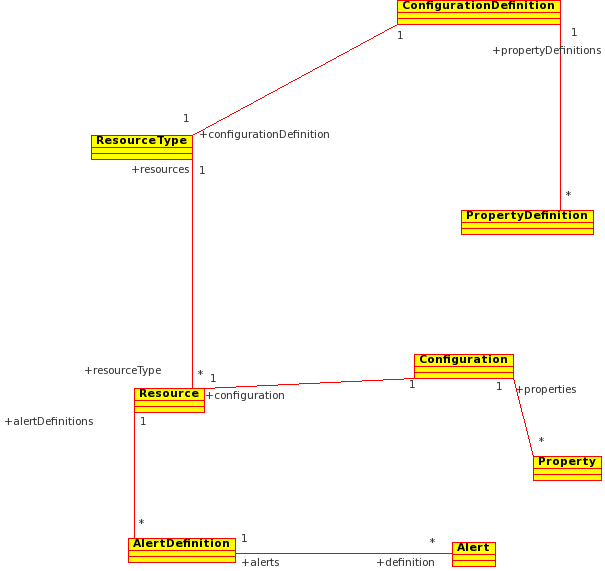
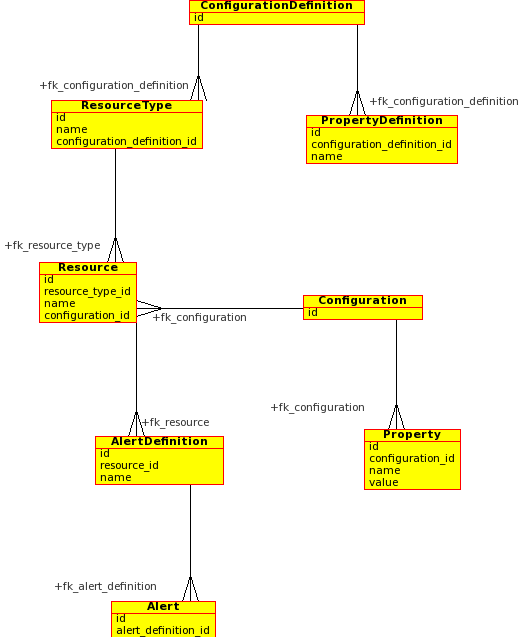

In http://www.rhq-project.org[RHQ], we are currently contemplating
implementing a series of automated performance tests. For those tests to
make any sense, we have to provide them with some initial data to work
with.

So the goal is quite simple. Export some defined dataset from an
existing database, store it away and import it back again before a test
is run. Easy. When I started researching the export part of the problem,
I thought there's bound to be something out there already in existence
that would do the job. And I was right. The
http://www.dbunit.org[dbUnit] project is exactly what I was looking for.
They support extraction of the data from the database and can even
follow the foreign key relationships (in both ways) to export the
necessary data to keep referential integrity. Great.

But wait. Our data model isn't that simple. I certainly want all the
data that my core dataset depends on to be included in the export, but I
also want *some* of the data that depends on my dataset.

Ok that didn't make much sense, so let me introduce a little example to
explain the problems on. First, let's look at the class diagram, that
will show the relationships between different entities in the model.

+++<a href="../../../../../images/class-diagram.png" data-lightbox="1">+++

+++</a>+++

These entities are mapped to these tables:

+++<a href="../../../../../images/entity-relationship-diagram.png" data-lightbox="2">+++

+++</a>+++

Now let's say I wanted to export all the resources with their
configurations but I'm not interested in the alert definitions.
Obviously this is going to require some kind of configuration.

I could stay on the database level and for example create a
configuration where I would specifically state something like "I want
data from this table." or "I'm interested in this table and all its
dependencies but this particular foreign key." and implement a dbUnit
search based on this configuration but I'm a Java developer and even
though I can write my SQL statements and design a (more or less)
reasonable database schema, I certainly don't love that job. To find out
the relationships between tables, looking at the JPA annotated Java code
is much quicker and more pleasant to me than looking at table and
foreign key definitions.

Before I dive into more details let me show you the configuration file
that will achieve the above goal:

```xml
<graph includeExplicitDependentsImplicitly="true" 
       packagePrefix="org.rhq.core.domain.resource">
    <entity name="Resource" root="true">
        <filter>SELECT ID FROM RESOURCE WHERE NAME='myResource'</filter>
        <rel field="configuration"/>
    </entity>
    <entity name="ResourceType" includeAllFields="true">
        <rel field="resources" exclude="true"/>
    </entity>
</graph>
```

This is still a bit of a mouthful but at the same time it's very
powerful. What I'm basically saying there is that I want to export a
resource with the name "myResource" and I only want to include its
configuration in the export (of course the simple properties of the
resource are implicitly exported but configuration is the only
*relationship* that gets exported along with it). Further, I'm telling
the exporter that it's free to export all the data of the ResourceType
entities my Resource is dependent upon but I don't want to include the
resources of the ResourceType in the export. This is to prevent the
other resources to "leak" to the export due to the explicit relationship
of the ResourceType and its "child" Resource entities. The mysterious
"`includeExplicitDependetsImplicitly`" attribute tells the exporter to
include all dependents of the entities it encounters unless configured
otherwise.

I want the above configuration to cause the exporter to include the
following in the export (look at the above class diagram to get a better
understanding why I need the below):

1.  "myResource" resource
2.  Its configuration and all its properties
3.  The resource type of the resource
4.  The configuration definition associated with that resource type
5.  All the property definitions of the configuration definition

Details
-------

To achieve the above functionality I needed to create a bridge that
would look at the JPA annotations in my domain layer classes and
translate the relationships expressed there into SQL terms. Once I have
the SQL representation of the domain model relationships I can feed that
into dbUnit and use it to export and import the data as well (I also let
dbUnit figure out the proper insertion order to keep the referential
integrity but more on that later).

The code turned out to be fairly simple and basically consists of
creation of an
http://git.fedorahosted.org/git/?p=rhq/rhq.git;a=blob;f=modules/helpers/perftest-support/src/main/java/org/rhq/helpers/perftest/support/jpa/EntityDependencyGraph.java;hb=perftest[entity
dependency graph], where nodes represent the JPA entities and edges
represent individual relationships (i.e. a directed, cyclic, multiply
connected graph). The JPA annotations contain all the information to
translate the entities and their relationships into the terms of SQL
tables and columns, the translation is only slightly complicated by the
possibility of relation tables (e.g. a relation table to describe a
`@ManyToMany` relationship) (the code is
http://git.fedorahosted.org/git/?p=rhq/rhq.git;a=blob;f=modules/helpers/perftest-support/src/main/java/org/rhq/helpers/perftest/support/jpa/mapping/MappingTranslator.java;hb=perftest[here]).

With the SQL mapping at hand I could start linking the code I had with
the functionality defined in dbUnit. I chose to implement it as a
http://www.dbunit.org/apidocs/index.html?org/dbunit/dataset/filter/ITableFilter.html[ITableFilter].
By inheriting from
http://www.dbunit.org/apidocs/index.html?org/dbunit/database/DatabaseSequenceFilter.html[DatabaseSequenceFilter]
I got the correct table order in the export for free and by retaining
the insertion order in the sets of the allowed PKs while traversing the
entity dependency graph, I was also able to retain the correct insertion
order even in cases where a table has a foreign key on itself. My
`EntityRelationshipFilter` can use the above mentioned configuration to
restrict the traversal of the entity dependency graph and therefore
restrict the resulting export (by relying on
http://git.fedorahosted.org/git/?p=rhq/rhq.git;a=blob;f=modules/helpers/perftest-support/src/main/java/org/rhq/helpers/perftest/support/jpa/ConfigurableDependencyInclusionResolver.java;hb=perftest[an
inclusion resolver] to tell it what to do). You can take a look at the
code
http://git.fedorahosted.org/git/?p=rhq/rhq.git;a=blob;f=modules/helpers/perftest-support/src/main/java/org/rhq/helpers/perftest/support/dbunit/EntityRelationshipFilter.java;hb=perftest[here].

Conclusion
----------

Relying on dbUnit to do the "low-level" data export and import for me, I
could create a "Java developer friendly" data export tool in just a
little bit more than a week's time. The good thing is that it is
completely generic and so it could be easily used with other projects
than RHQ (of course, more work would be required on the tool in that
case because the translation from JPA to SQL isn't completely
implemented. For example it's missing handling the implicit values of
the JPA annotations (e.g. the table name derived from the class name if
the `@Table` annotation doesn't explicitly specify a name) and I'm sure
I missed some corner cases in handling the relationships as well. But it
seems to work for RHQ at the moment which means that it's already quite
capable because our domain model isn't a trivial one. If there was
interest, I'd be more than happy to help create a standalone
full-featured tool out of this and take it out of the RHQ
http://git.fedorahosted.org/git/?p=rhq/rhq.git;a=tree;f=modules/helpers/perftest-support;hb=perftest[source
code]. You can read even more about the tool on our wiki
http://wiki.rhq-project.org/display/RHQ/Entity+Driven+Database+Setup[here].

'''''

In the next blog entry, I'll take a look at the "import and test" part
of the solution, namely on the integration of the database setup and
data import with TestNG.
